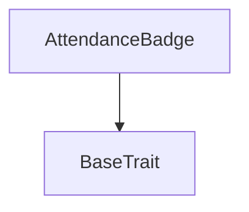
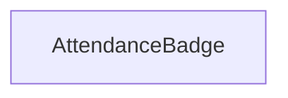

# Tact compilation report
Contract: AttendanceBadge
BoC Size: 610 bytes

## Structures (Structs and Messages)
Total structures: 17

### DataSize
TL-B: `_ cells:int257 bits:int257 refs:int257 = DataSize`
Signature: `DataSize{cells:int257,bits:int257,refs:int257}`

### SignedBundle
TL-B: `_ signature:fixed_bytes64 signedData:remainder<slice> = SignedBundle`
Signature: `SignedBundle{signature:fixed_bytes64,signedData:remainder<slice>}`

### StateInit
TL-B: `_ code:^cell data:^cell = StateInit`
Signature: `StateInit{code:^cell,data:^cell}`

### Context
TL-B: `_ bounceable:bool sender:address value:int257 raw:^slice = Context`
Signature: `Context{bounceable:bool,sender:address,value:int257,raw:^slice}`

### SendParameters
TL-B: `_ mode:int257 body:Maybe ^cell code:Maybe ^cell data:Maybe ^cell value:int257 to:address bounce:bool = SendParameters`
Signature: `SendParameters{mode:int257,body:Maybe ^cell,code:Maybe ^cell,data:Maybe ^cell,value:int257,to:address,bounce:bool}`

### MessageParameters
TL-B: `_ mode:int257 body:Maybe ^cell value:int257 to:address bounce:bool = MessageParameters`
Signature: `MessageParameters{mode:int257,body:Maybe ^cell,value:int257,to:address,bounce:bool}`

### DeployParameters
TL-B: `_ mode:int257 body:Maybe ^cell value:int257 bounce:bool init:StateInit{code:^cell,data:^cell} = DeployParameters`
Signature: `DeployParameters{mode:int257,body:Maybe ^cell,value:int257,bounce:bool,init:StateInit{code:^cell,data:^cell}}`

### StdAddress
TL-B: `_ workchain:int8 address:uint256 = StdAddress`
Signature: `StdAddress{workchain:int8,address:uint256}`

### VarAddress
TL-B: `_ workchain:int32 address:^slice = VarAddress`
Signature: `VarAddress{workchain:int32,address:^slice}`

### BasechainAddress
TL-B: `_ hash:Maybe int257 = BasechainAddress`
Signature: `BasechainAddress{hash:Maybe int257}`

### AttendanceRecord
TL-B: `_ badge:uint256 student:address timestamp:uint32 = AttendanceRecord`
Signature: `AttendanceRecord{badge:uint256,student:address,timestamp:uint32}`

### BadgeValue
TL-B: `_ badge:uint256 = BadgeValue`
Signature: `BadgeValue{badge:uint256}`

### SetCodeBadge
TL-B: `set_code_badge#40308a31 codeHash:uint256 badge:uint256 = SetCodeBadge`
Signature: `SetCodeBadge{codeHash:uint256,badge:uint256}`

### ClaimBadge
TL-B: `claim_badge#76a819e6 codeHash:uint256 = ClaimBadge`
Signature: `ClaimBadge{codeHash:uint256}`

### GetByCode
TL-B: `get_by_code#d1eb64c3 badge:uint256 = GetByCode`
Signature: `GetByCode{badge:uint256}`

### GetByStudent
TL-B: `get_by_student#967dff71 student:address = GetByStudent`
Signature: `GetByStudent{student:address}`

### AttendanceBadge$Data
TL-B: `_ owner:address codeToBadge:dict<uint256, ^BadgeValue{badge:uint256}> records:dict<uint256, ^AttendanceRecord{badge:uint256,student:address,timestamp:uint32}> nextId:uint256 = AttendanceBadge`
Signature: `AttendanceBadge{owner:address,codeToBadge:dict<uint256, ^BadgeValue{badge:uint256}>,records:dict<uint256, ^AttendanceRecord{badge:uint256,student:address,timestamp:uint32}>,nextId:uint256}`

## Get methods
Total get methods: 2

## getAttendeesByCode
Argument: msg

## getAttendeesByStudent
Argument: msg

## Exit codes
* 2: Stack underflow
* 3: Stack overflow
* 4: Integer overflow
* 5: Integer out of expected range
* 6: Invalid opcode
* 7: Type check error
* 8: Cell overflow
* 9: Cell underflow
* 10: Dictionary error
* 11: 'Unknown' error
* 12: Fatal error
* 13: Out of gas error
* 14: Virtualization error
* 32: Action list is invalid
* 33: Action list is too long
* 34: Action is invalid or not supported
* 35: Invalid source address in outbound message
* 36: Invalid destination address in outbound message
* 37: Not enough Toncoin
* 38: Not enough extra currencies
* 39: Outbound message does not fit into a cell after rewriting
* 40: Cannot process a message
* 41: Library reference is null
* 42: Library change action error
* 43: Exceeded maximum number of cells in the library or the maximum depth of the Merkle tree
* 50: Account state size exceeded limits
* 128: Null reference exception
* 129: Invalid serialization prefix
* 130: Invalid incoming message
* 131: Constraints error
* 132: Access denied
* 133: Contract stopped
* 134: Invalid argument
* 135: Code of a contract was not found
* 136: Invalid standard address
* 138: Not a basechain address
* 58772: only owner
* 60396: unknown code

## Trait inheritance diagram

## Contract dependency diagram

